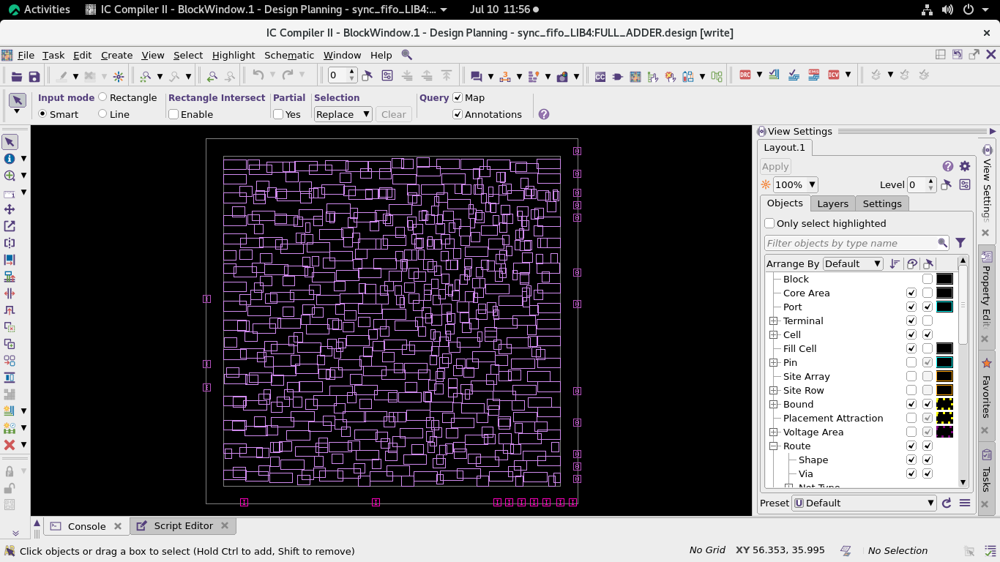
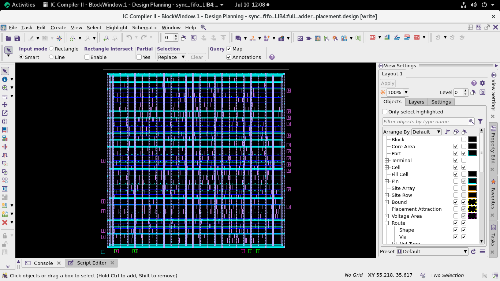
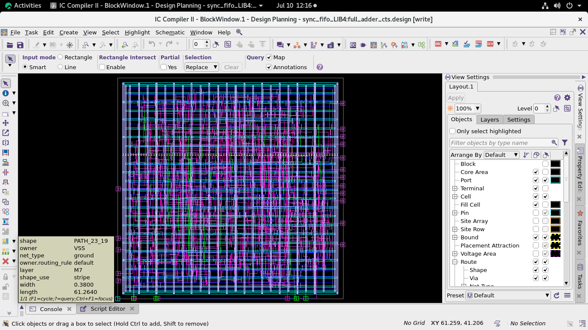
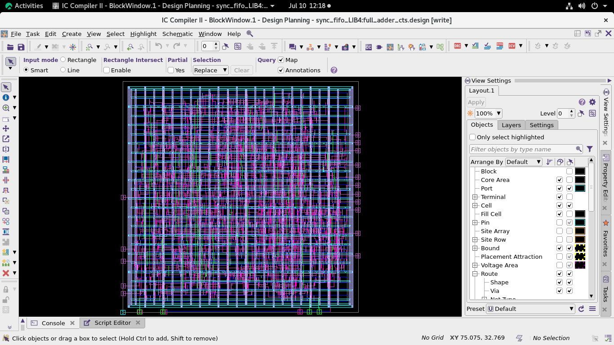
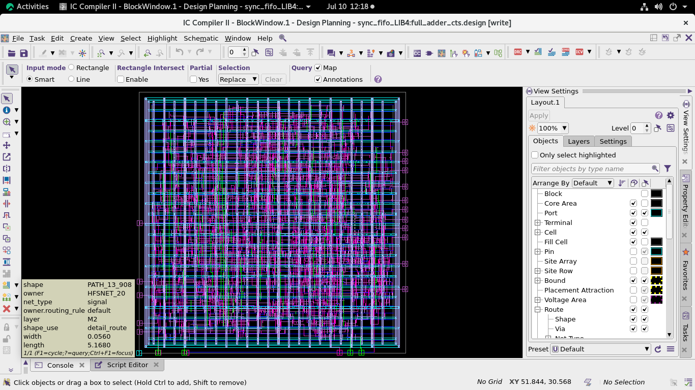

# Synchronous-FIFO-RTL-to-GDSII-Flow
# 🚀 Synchronous FIFO: RTL-to-GDSII Flow

A complete RTL-to-GDSII implementation of a **Synchronous FIFO** using an ASIC design flow. This project demonstrates the complete physical design process—from RTL design and logic synthesis to floorplanning, placement, clock tree synthesis (CTS), routing, signoff, and final synthesis outputs.

---

## 📌 Project Overview

A Synchronous FIFO (First-In First-Out) is a memory buffer where both read and write operations are controlled by the same clock. This project implements the FIFO in Verilog and takes it through the complete ASIC implementation flow.

---

## 🛠️ Tools Used

- Verilog HDL
- Synopsys Design Compiler (DC)
- Synopsys ICC2
- Static Timing Analysis (STA)
- TCL Scripting

---

# 📂 Repository Structure

```
Synchronous-FIFO-RTL-to-GDSII-Flow
│
├── Images/
│   ├── floorplanning.png
│   ├── after floor plan utilization.png
│   ├── powerplanning.png
│   ├── after power planning.png
│   ├── placement.png
│   ├── CTS.png
│   ├── route.png
│   └── signoff.png
│
├── Outputs/
│   ├── fifoo_mapped.vg
│   └── fifoo_mapped.sdc
│
├── Reports/
│   ├── report_area.rpt
│   ├── report_constraints.rpt
│   ├── report_power.rpt
│   ├── report_qor.rpt
│   └── report_timing.rpt
│
├── RTL/
│   └── fifoo.v
│
├── Scripts/
│   ├── 01_setup.tcl
│   ├── 02_netlist_read.tcl
│   ├── 03_floorplan.tcl
│   ├── 04_power_planning.tcl
│   ├── 05_placement.tcl
│   ├── 06_clock.tcl
│   ├── 07_route.tcl
│   ├── 08_signoff_outputs.tcl
│   ├── dc.tcl
│   └── fifoo.sdc
│
└── README.md
```

---

# 🔄 ASIC Design Flow

```
RTL Design
     │
     ▼
Logic Synthesis
     │
     ▼
Floorplanning
     │
     ▼
Power Planning
     │
     ▼
Placement
     │
     ▼
Clock Tree Synthesis (CTS)
     │
     ▼
Routing
     │
     ▼
Signoff
     │
     ▼
Mapped Netlist & Reports
```

---

# 📊 Reports Generated

- Area Report
- Timing Report
- Power Report
- Constraint Report
- QoR (Quality of Results) Report

---

# 📷 Physical Design Stages

### Floorplanning


### Floorplan Utilization


### Power Planning


### After Power Planning


### Placement


### Clock Tree Synthesis (CTS)


### Routing


### Signoff


---

# 📁 Outputs

The generated synthesis outputs include:

- Gate-level mapped netlist (.vg)
- Mapped SDC file

---

# ▶️ How to Run

1. Perform RTL synthesis using `dc.tcl`.
2. Run ICC2 physical design scripts sequentially:
   - 01_setup.tcl
   - 02_netlist_read.tcl
   - 03_floorplan.tcl
   - 04_power_planning.tcl
   - 05_placement.tcl
   - 06_clock.tcl
   - 07_route.tcl
   - 08_signoff_outputs.tcl
3. Review generated reports and outputs.

---

# 👨‍💻 Author

**Tirth Bavaliya**

Electronics & Communication Engineering (ECE)

Interested in RTL Design | Physical Design | ASIC Design | VLSI

---
